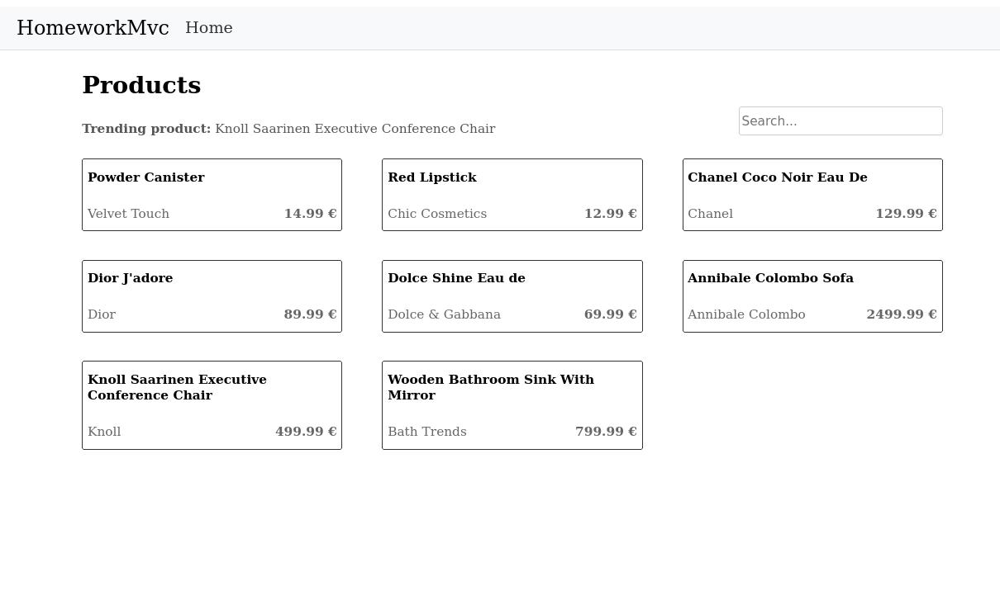
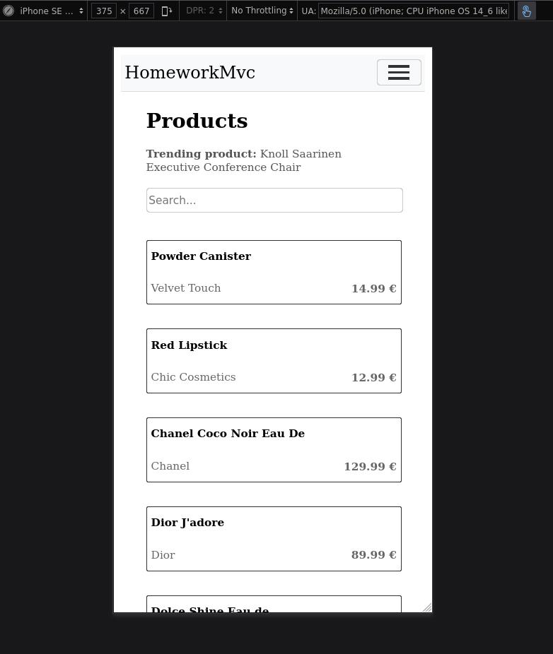

# ./riskselectionhomework 

## Table of Contents

- [Screenshots](#screenshots)
- [Project Structure](#project-structure)
- [Prerequisites](#prerequisites)
- [Setup and Running](#setup-and-running)
  - [1. Clone the Repository](#1-clone-the-repository)
  - [2. Configure Environment Variables](#2-configure-environment-variables)
  - [3. Run the Backend API](#3-run-the-backend-api)
  - [4. Run the Frontend](#4-run-the-frontend)
- [Testing](#testing)

---

## Screenshots





## Project Structure
```
  ~/riskselectionhomework
   Homework.Api                             # Backend API in ASP.NET Core
     Controllers                            # API controllers for managing requests 
   │ └ 󰌛 ProductsController.cs 
     Exceptions
   │ │ 󰌛 JsonParseException.cs
   │ └ 󰌛 ServiceUnavailableException.cs
     Infrastructure                         # Core infrastructure for external API clients 
   │ └ 󰌛 ProductApiClient.cs 
     Interfaces 
   │ │ 󰌛 IProductApiClient.cs 
   │ └ 󰌛 IProductService.cs 
     Middleware
   │ └ 󰌛 ErrorHandlerMiddleware.cs 
     Models
   │ │ 󰌛 Product.cs 
   │ └ 󰌛 ProductSourceOptions.cs 
     Services                               # Business logic for handling product data
   │ │ 󰌛 ApiResponseHandler.cs 
   │ └ 󰌛 ProductService.cs 
   │ 󰗀 Homework.Api.csproj 
   │ 󰌛 Program.cs 
   └ 󰘦 appsettings.json                       # Configuration file for environment variables
   Homework.Api.Tests                       # Unit tests for backend API
     Controllers
   │ └ 󰌛 ProductControllerTests.cs 
     Factories 
   │ └ 󰌛 MockHttpMessageHandlerFactory.cs 
     Helpers 
   │ │ 󰌛 MockHttpHelper.cs 
   │ └ 󰌛 MockHttpMessageHandler.cs 
     Infrastructure 
   │ └ 󰌛 ProductApiClientTests.cs 
     Services 
   │ │ 󰌛 ApiResponseHandlerTests.cs 
   │ └ 󰌛 ProductServiceTests.cs 
   └ 󰗀 Homework.Api.Tests.csproj 
   Homework.Client                          # Frontend client in React and TypeScript 
     src 
   │   components 
   │ │ │  MainTitle.tsx 
   │ │ │  NavBar.tsx
   │ │ │  ProductCard.tsx 
   │ │ │  ProductGrid.tsx 
   │ │ │  SearchBar.tsx 
   │ │ │  SearchContainer.tsx 
   │ │ └  TrendingProduct.tsx 
   │   interfaces 
   │ │ └ 󰛦 product.ts 
   │ │  App.tsx 
   │ │ 󰛦 api.ts 
   │ │ 󰛦 config.ts 
   │ │  index.tsx 
   │ └ 󰌜 styles.css 
```

## Prerequisites

- [.NET 8 SDK](https://dotnet.microsoft.com/download)
- [Node.js and npm](https://nodejs.org/en/download/)

---

## Setup and Running

### 1. Clone the Repository

```bash
git clone https://github.com/rasmushy/riskselectionhomework.git
cd riskselectionhomework
```

### 2. Configure Environment Variables

In the backend, set up your API URLs in `appsettings.json` under `ProductSourceOptions`. Example:

```json
{
  "ProductSourceOptions": {
    "ProductSourceUrls": [
      "https://dummyjson.com/products"
    ]
  }
}
```

### 3. Run the Backend API

Navigate to the backend folder and run the API:

```bash
cd Homework.Api
dotnet restore
dotnet run
```

The API will start by default on `http://localhost:5153/api/products`.

### 4. Run the Frontend

In a new terminal, navigate to the frontend folder:

```bash
cd Homework.Client
npm install
npm start
```

The React app will start on `http://localhost:3000` and connect to the backend API.

---

## Testing

### Backend Tests

The `Homework.Api.Tests` project includes the following tests:

- **ProductServiceTests**: Validates that `ProductService` correctly fetches and processes product data from external APIs, including error handling for network and JSON issues.
- **ProductsControllerTests**: Ensures that `ProductsController` provides the correct responses based on product data availability, including cases of empty, null, and exceptional data.
- **ProductApiClientTests**: Tests `ProductApiClient` to confirm that it correctly retrieves and handles responses from the external API.
- **ApiResponseHandlerTests**: Ensures that `ApiResponseHandler` can handle both valid and malformed JSON data, throwing exceptions when appropriate.

To execute all backend unit tests:
```bash
cd Homework.Api.Tests
dotnet test
```
